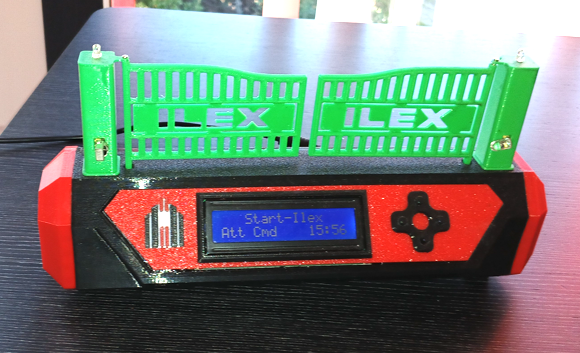
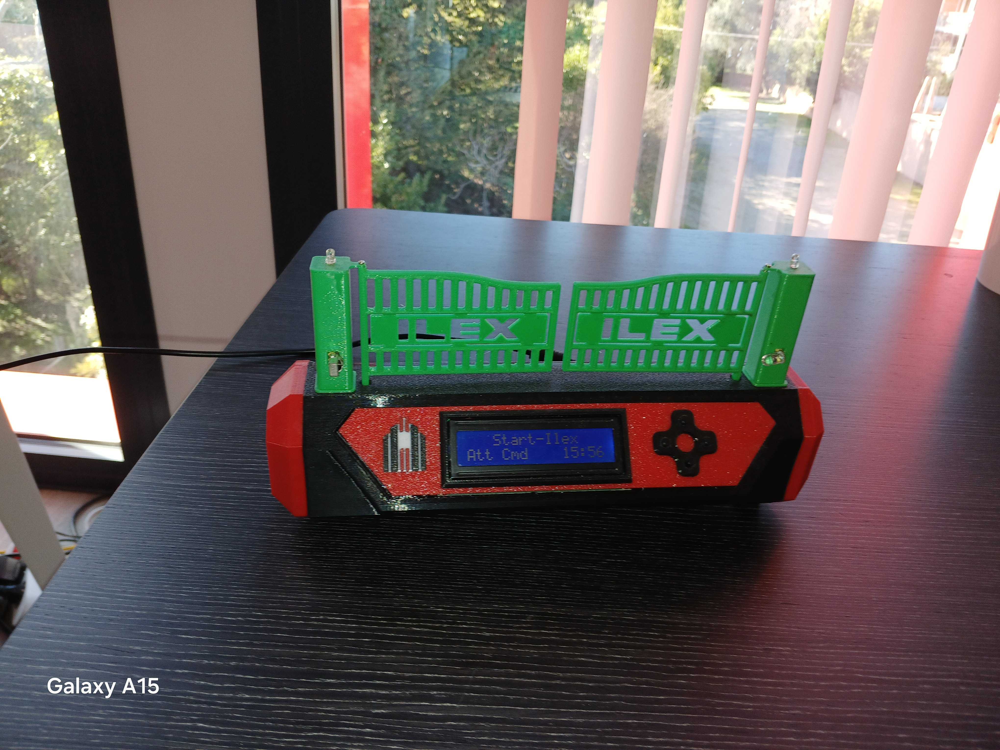
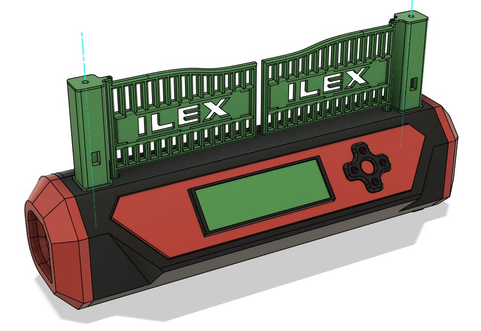
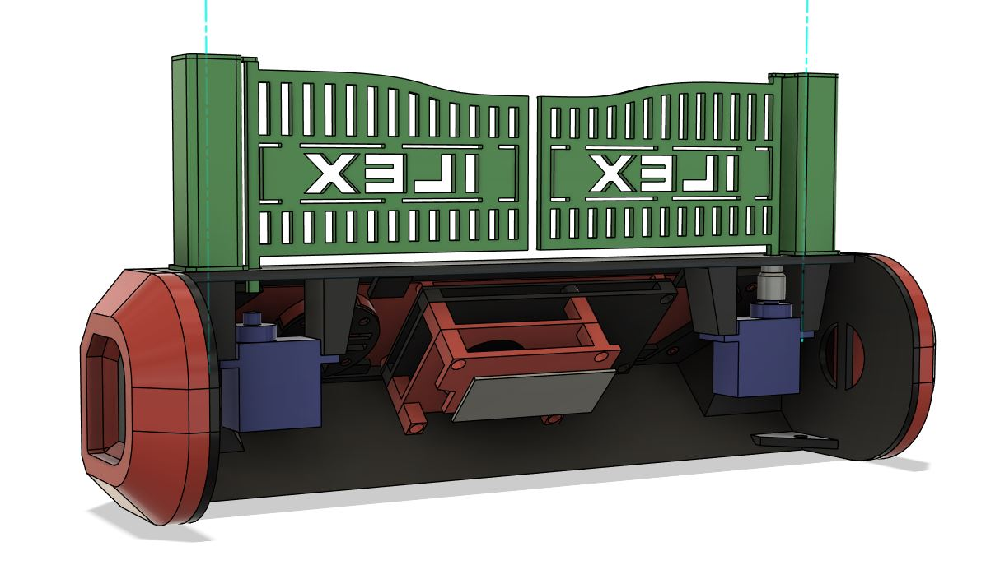
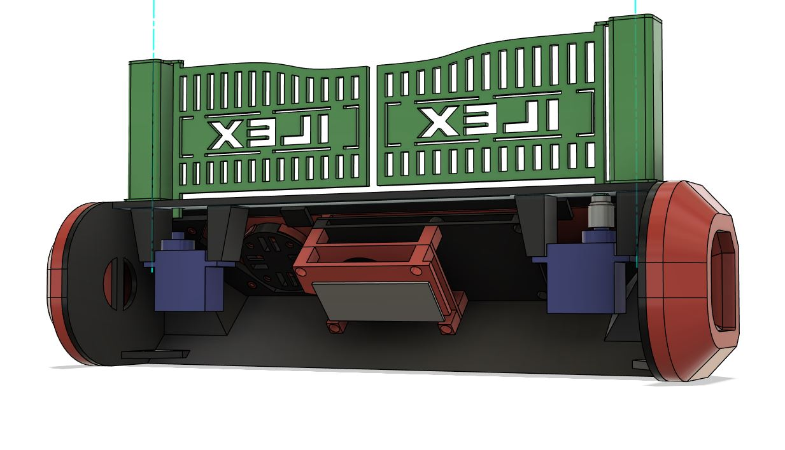

# 🚀 Portail – Maquette Automatisée

Maquette fonctionnelle d’un **portail automatique** réalisé avec un **Arduino Nano Every**.

Projet hardware + software complet : pilotage précis d’un portail miniature avec détection d’obstacles, apprentissage des positions, gestion de vitesse/ralentissement, et même une fonction réveil-matin intégrée !

## Fonctionnalités

- **servomoteur** pour l’ouverture/fermeture du portail
- **LED clignotante** pendant le mouvement + **éclairage de zone**
- **Cellule photoélectrique** (photodiode) pour détection d’obstacle ou confirmation de position
- **Apprentissage manuel** des positions finale (ouvert/fermé) et des zones de ralentissement
- **Preavis de mouvement** reglable
- Réglages fins via menu :
  - Temps de pause en position ouverte
  - Vitesse du mouvement
  - Distance / zone de ralentissement avant fin de course
- Fonction **réveil-matin** (alarme horaire qui ouvre le portail et déclenche une buzzer)
- Interface menu complète avec LCD et boutons

## Matériel utilisé

- Arduino Nano Every
- Servomoteur (type SG90 ou similaire)
- Photodiode + résistance (cellule photoélectrique)
- 2× LEDs + résistances (clignotant + éclairage)
- Buzzer pour le réveil, boutons poussoirs pour menu, écran LCD
- Impression 3d

